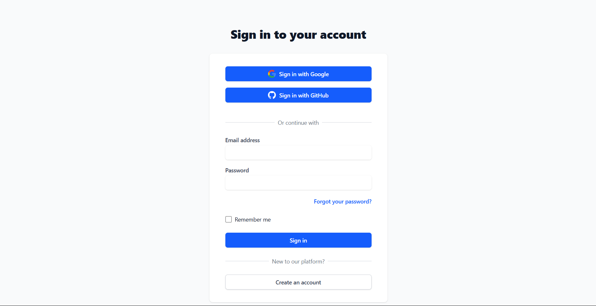
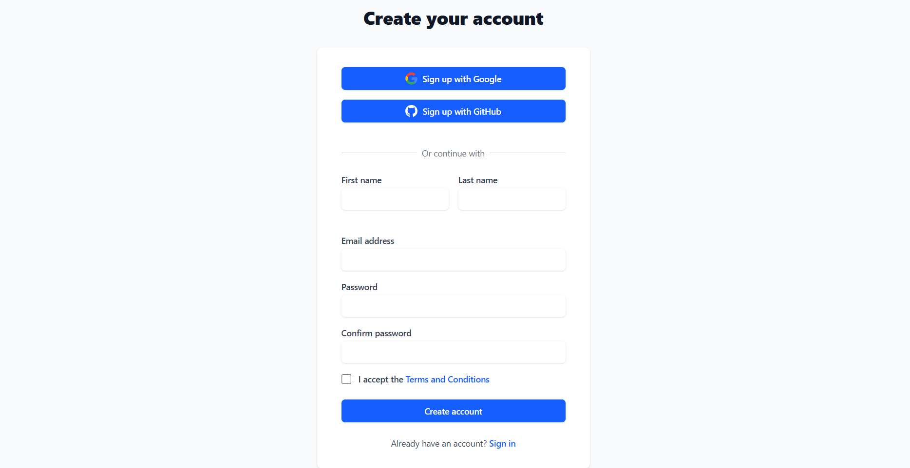
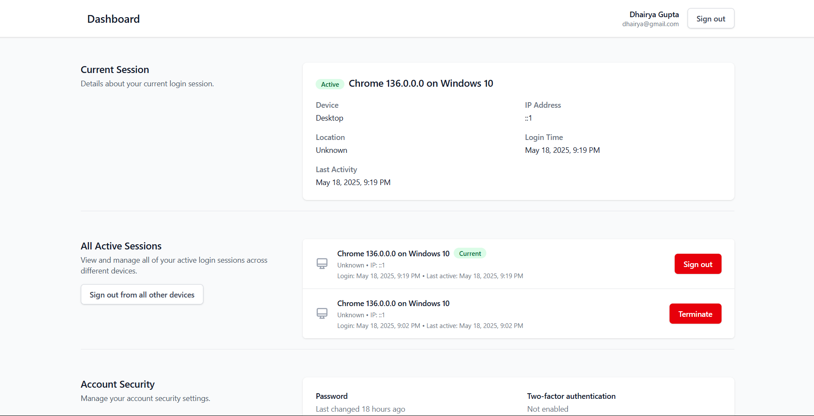
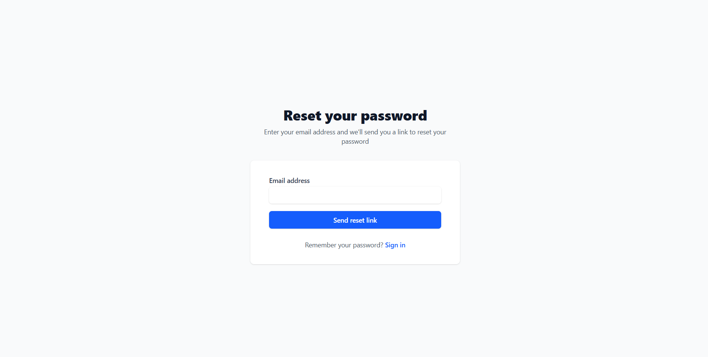

# 🔐 Advanced Auth System

A full-featured authentication system built with modern best practices. This project goes beyond basic login/signup, offering robust security, session control, 2FA, and developer-friendly structure. Perfect for production-grade applications.

---

## ✨ Features

- **📧 Email & Password Authentication**

  - Secure register & login with hashed passwords
  - Input validation using **Zod**

- **🌐 OAuth Integration**

  - Login with **Google** & **GitHub** using OAuth2

- **🛡️ Two-Factor Authentication (2FA)**

  - TOTP-based using apps like **Google Authenticator** or **Authy**
  - Enable/disable 2FA from dashboard

- **🧠 Smart Session Management**

  - Track sessions per **device/browser/location**
  - View **active sessions** with details: IP, OS, browser, device type, location
  - **Terminate sessions** from other devices

- **🔒 Password Management**

  - Change password with validation
  - Show **last password change date**

- **📬 Forgot Password**

  - Send password reset email with secure token link

- **🔁 Token Handling**

  - JWT **accessToken** and **refreshToken** implementation
  - **Refresh token rotation** for added security
  - **Auto-refresh** access tokens on expiry
  - Persistent login using **Remember Me** (cookies)

- **🚫 Rate Limiting**

  - Protect routes against abuse and brute-force attacks

- **✅ Form Validation**

  - All input validations handled via **Zod** schema

---

## 📊 Session Insights Example

Each user session contains:

- Session ID
- IP Address & Geo Location 🌍
- Device Info: OS, Browser, Type 🖥️📱
- Login Time
- Password changed date
- 2FA enabled status

---

## 📸 Screenshots

| Page                    | Screenshot                              |
| ----------------------- | --------------------------------------- |
| 🔐 Login Page           |            |
| 📝 Register Page        |  |
| 🧑‍💼 Session Dashboard    |        |
| 🔄 Password Reset Page  |   |
| 🔑 Change Password Page |  |

## 🧪 Technologies Used

### 🖥️ Frontend

Built with modern React stack and TypeScript for type safety:

- ⚛️ **React.js** – UI framework
- 🌐 **React Router** – Client-side routing
- 💅 **Tailwind CSS** – Utility-first CSS framework
- ✅ **Zod** – Schema validation (shared with backend)
- 🧼 **React Hook Form** – Form handling
- 📦 **Axios** – HTTP client
- 🔠 **TypeScript** – Type-safe development

### 🔧 Backend

Robust and scalable API built with Express and PostgreSQL:

- 🚀 **Node.js & Express** – RESTful API server
- 🛢 **PostgreSQL** – Relational database
- 🧬 **Prisma ORM** – Database access and migrations
- 🔐 **JWT (JSON Web Tokens)** – Access and refresh token-based authentication
- 🛂 **Passport.js** – OAuth integration (Google & GitHub)
- 📬 **Resend** – Email provider for password reset
- 🔁 **Refresh Token Rotation** – Automatic token refresh with reuse detection
- 🌍 **GeoIP-lite** – Detect user location by IP
- 🕵️ **Rate Limiter** – Prevent abuse and brute-force attacks
- 🔐 **TOTP (2FA)** – Time-based One-Time Password with **Speakeasy** and **QRCode**
- ✅ **Zod** – Request validation

> 📚 Both frontend and backend are fully typed and validated using Zod for end-to-end safety.

---

## 🚀 How It Works

### Register/Login (Email & Password)

- Validated by Zod
- Passwords hashed using bcrypt

### OAuth Login

- Redirects to Google/GitHub
- Retrieves email/profile
- Auto-registers new user if not found

### 2FA (TOTP)

- User opts to enable 2FA
- Secret generated + QR code shown
- Validates code from app, then stores
- During login, 2FA prompt appears if enabled

### Session Management

- On each login, a new session is created
- Stores fingerprint: IP, OS, browser, etc.
- UI allows viewing and terminating sessions

### Forgot Password

- User requests reset → email with token sent
- Secure form lets user reset with new password

### Tokens

- Access tokens short-lived (e.g., 15 min)
- Refresh tokens long-lived and rotated
- Auto-refresh logic ensures smooth UX

---

## 🚀 Setup Instructions

Follow these steps to run the project locally:

---

### 1. 📦 Clone the Repository

```bash
git clone https://github.com/your-username/your-repo-name.git
cd your-repo-name

```

### 2. 🛠️ Set Up Environment Variables

Both the `client` and `server` folders contain an `.env.sample` file.  
You need to copy and rename them to `.env`, and then fill in the required environment variables.

```bash
# From project root
cp client/.env.sample client/.env
cp server/.env.sample server/.env
```

⚠️ Be sure to replace placeholder values with your actual environment-specific keys (e.g., database URL, JWT secrets, OAuth client IDs, etc.)

### 3. Install Dependencies

Install packages separately in both client and server directories:

```bash
# Install frontend dependencies
cd client
npm install

# Install backend dependencies
cd ../server
npm install
```

### 4. 🚀 Run the Development Servers

Start both frontend and backend dev servers in separate terminals.

```bash
# In one terminal
cd client
npm run dev

# In another terminal
cd server
npm run dev
```

### 5. ✅ Visit the App

Once both servers are running, open the frontend in your browser:

http://localhost:5173

The backend server will be running at:

http://localhost:5000

🎉 You're all set! You can now explore the full authentication system locally.

---

## ✅ TODO & Improvements

- Email verification on signup
- Backup recovery codes for 2FA
- Admin panel for user control

---

## 🙌 Contributions

Pull requests are welcome! If you have ideas for improvements, feel free to fork and submit.

---
